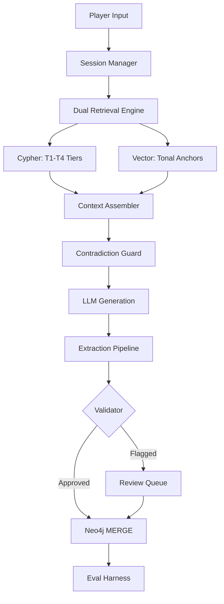

# Narrative Knowledge Graph Engine (Lorekeeper)
## Project Design Document v1.0

**Author:** Kutlu Mizrak
**Stack:** Python · Neo4j · LangChain · LangGraph · ChromaDB · FastAPI · Streamlit
**Repo Identifier:** LKGE — Lorekeeper Graph Engine

---

## Table of Contents

1. [Executive Summary](#1-executive-summary)
2. [Gap Analysis and Solutions](#2-gap-analysis-and-solutions)
3. [System Architecture](#3-system-architecture)
4. [Layer Specifications](#4-layer-specifications)
5. [Evaluation Harness](#5-evaluation-harness)
6. [Implementation Plan](#6-implementation-plan)
7. [Prompt Engineering Contracts](#7-prompt-engineering-contracts)
8. [Branching and Session State](#8-branching-and-session-state)
9. [README Construction Guide](#9-readme-construction-guide)
10. [Appendix A: Cypher Query Reference](#appendix-a-cypher-query-reference)
11. [Appendix B: Evaluation Run Output Schema](#appendix-b-evaluation-run-output-schema)

---

## 1. Executive Summary

This document specifies the architecture, implementation plan, and evaluation strategy for the **Narrative Knowledge Graph Engine (Lorekeeper / LKGE)** — an agentic interactive storytelling system that uses a live Neo4j knowledge graph as the memory and consistency backbone for LLM-powered narrative generation.

The system is directly analogous to production graph-RAG platforms, applying identical retrieval and governance patterns to creative narrative rather than document intelligence. Every segment generated is grounded in a continuously updated graph of characters, locations, events, and causal chains, specifically designed for eliminating contradiction and enabling true narrative persistence across long story arcs.


---

## 2. Gap Analysis and Solutions

The following documents each identified gap in the original concept, its root cause, and the adopted solution strategy.

| Gap | Root Cause | Risk If Unaddressed | Adopted Solution |
|-----|-----------|--------------------|--------------------|
| **Schema evolution** | Early chapters can't predict which entities matter later | Graph becomes stale or misrepresents story state | Flexible schema with late-binding type promotion via LLM reclassification pass at chapter boundaries |
| **Subgraph selection at scale** | Naive full-graph retrieval breaks as node count grows | Context window overflow; irrelevant facts degrade generation | Tiered Cypher retrieval policy: active-scene subgraph first, then causal chain expansion, then global lookup by relevance score |
| **Character voice vs. state** | Graph captures actions/relationships but not speaking style | Characters act consistently but sound identical | Parallel persona store: each Character node links to a structured voice document with tone, vocabulary, and mannerism descriptors |
| **Write-back loop data quality** | LLM extraction is imperfect; missed events poison the graph | Accumulated errors cause contradictions in later segments | Two-stage extraction: LLM proposes, deterministic validator checks schema and flags low-confidence items before MERGE |
| **No evaluation metric** | No baseline comparison methodology defined | Project is a demo, not a proof | Consistency Eval Harness: paired generation (NKGE vs. baseline), LLM-judged contradiction scoring, plus automated graph coverage and density metrics |
| **Player agency creates branching** | Interactive choices fork the story graph into incompatible states | Graph becomes inconsistent across sessions | Event versioning with branch-tagged nodes; active branch pointer in session state; Cypher queries filter by branch ID |

---

## 3. System Architecture

### 3.1 Component Overview

The system consists of six integrated layers that form a **read-write-verify loop** around every story segment generated.

| Layer | Responsibility | Primary Technology |
|-------|---------------|-------------------|
| **L1: Narrative Schema** | Defines ontology, node types, relationship types, and property contracts | Neo4j, Pydantic models |
| **L2: Extraction Pipeline** | Parses generated segments into validated entities and writes to graph | LangChain structured output, Pydantic v2, Neo4j MERGE |
| **L3: Persona Store** | Maintains character voice profiles alongside relational graph nodes | ChromaDB, structured JSON persona documents |
| **L4: Dual Retrieval Engine** | Assembles pre-generation context from vector RAG + Cypher graph RAG | LangGraph, Neo4j Cypher, ChromaDB |
| **L5: Contradiction Guard** | Pre-generation validation against known graph facts | Cypher constraint queries, LLM judge |
| **L6: Eval Harness** | Measures system performance with paired generation and scoring | Python eval runner, LLM judge, metrics store |

### 3.2 Data Flow — Per-Segment Generation Cycle

```
User Input (player action)
        │
        ▼
Session Manager ──── loads: branch_id, last N segments, active location, present characters
        │
        ▼
Dual Retrieval Engine
   ├── Cypher: T1 active scene → T2 causal chain → T3 hostile tensions → T4 orphans
   └── Vector: top-3 semantically similar past segments (tonal anchors)
        │
        ▼
Context Assembler ── merges graph facts + tonal anchors into structured prompt
        │
        ▼
Contradiction Guard ── runs 5 Cypher constraint checks; injects violations as reminders
        │
        ▼
LLM Generation (Claude claude-sonnet-4-6)
        │
        ▼
Extraction Pipeline
   ├── Stage 1: LLM proposes entities, relationships, confidence scores
   └── Stage 2: Validator checks schema, fuzzy name resolution, status consistency
        │
        ▼
Neo4j MERGE ── idempotent write, tagged with segment_id and branch_id
        │
        ▼
Eval Harness ── records inputs, outputs, graph state snapshot for offline scoring
```

### 3.3 Technology Stack

| Component | Technology | Rationale |
|-----------|-----------|-----------|
| Graph database | Neo4j Desktop (local) or AuraDB Free | Native Cypher, APOC library, vector index in Neo4j 5.x |
| LLM | Claude claude-sonnet-4-6 via Anthropic API | Structured JSON output reliability; long context window |
| Orchestration | LangGraph with typed state | Stateful agent graph matches read-write-verify loop; native branching |
| Vector store | ChromaDB (local) | Zero-setup local persistence; sufficient for demo scale |
| API layer | FastAPI | Async, OpenAPI docs, matches existing Lore Machine stack |
| Frontend | Streamlit | Rapid iteration; graph visualization via pyvis/st-agraph |
| Schema validation | Pydantic v2 | Strict field validation; JSON schema export for LLM prompts |
| Observability | OpenTelemetry + local OTLP collector | Trace per segment generation cycle; matches CV MLOps story |

---

## 4. Layer Specifications

### 4.1 Layer 1: Narrative Schema (Graph Ontology)

#### Node Types

| Node Label | Core Properties | Notes |
|------------|----------------|-------|
| `Character` | name, status (alive/dead/unknown), current_location_id, alignment, traits[] | Status transitions trigger downstream constraint invalidation |
| `Location` | name, type, accessible (bool), description_summary | accessible=false blocks character placement there |
| `Event` | description, seq_id, branch_id, outcome, timestamp | seq_id preserves causal ordering within a branch |
| `Object` | name, current_owner_id, significance, last_seen_location_id | Tracks item provenance across scenes |
| `Faction` | name, goals[], member_ids[] | Enables large-cast relationship compression |
| `Segment` | text, seq_id, branch_id, embedding_id | Links narrative text to graph state snapshot |

#### Relationship Types

| Relationship | Between | Key Properties |
|-------------|---------|----------------|
| `KNOWS` | Character ↔ Character | sentiment: allied/neutral/hostile, since_event_id |
| `LOCATED_AT` | Character → Location | as_of_seq_id, branch_id |
| `PARTICIPATED_IN` | Character → Event | role: protagonist/antagonist/witness |
| `CAUSED_BY` | Event → Event | Causal chain backbone; enables path reasoning |
| `OWNS` | Character → Object | since_event_id |
| `VISITED` | Character → Location | visit_count, last_seq_id |
| `MEMBER_OF` | Character → Faction | role, joined_event_id |
| `REFERENCES_GRAPH_STATE` | Segment → any node | Snapshot link for provenance and debugging |

#### Schema Evolution Strategy

Node type promotion is handled via a **reclassification pass** triggered at user-defined chapter boundaries or every N segments (configurable, default: 10). The LLM receives the current character list and returns a structured diff — trait updates, alignment changes, faction reassignments — not a full re-parse. The graph applies these as MERGE updates, preserving history via relationship timestamps.

---

### 4.2 Layer 2: Extraction Pipeline

#### Two-Stage Architecture

**Stage 1 — Propose:**
After each generated segment, a structured extraction prompt using Pydantic-constrained JSON asks the LLM to identify:
- New entities by type
- Modified properties of existing entities (matched by name)
- New relationships between named entities

Each item returns a `confidence` score (0.0–1.0) and a `supporting_quote` from the segment text.

**Stage 2 — Validate and Commit:**
A deterministic Python validator checks the proposal before any MERGE executes:

- **Confidence threshold:** items below 0.65 are flagged for review, not committed
- **Name resolution:** proposed names are fuzzy-matched against existing nodes to prevent duplicate creation (e.g., "Mara" vs "Maara")
- **Status consistency:** a dead character cannot be set to alive without an explicit resurrection event in the same segment
- **Relationship directionality:** `CAUSED_BY` requires both Event nodes to exist before the relationship is created

> **Human-in-the-Loop Mode:** In notebook mode (development), flagged items surface as an approval widget before commit. In API mode, they are queued in a review table with a 30-second auto-timeout defaulting to commit. This mirrors propose-approve-commit governance pattern that serves to reduce AI hallucination artifacts.

---

### 4.3 Layer 3: Persona Store

Each `Character` node stores a `persona_doc_id` linking to a ChromaDB document containing:

- **Voice descriptor:** formal/informal, verbose/terse, archaic/modern vocabulary tendency
- **Emotional baseline:** default emotional register (stoic, anxious, sardonic, etc.)
- **Speech mannerisms:** recurring phrases, punctuation style, metaphor domains
- **Knowledge boundaries:** what the character knows as of the last segment — critical for preventing characters from referencing facts they could not have learned

The persona document is retrieved alongside graph context during context assembly and injected into a dedicated `CHARACTER VOICES` section of the generation prompt, **separate from the factual consistency section**. The graph enforces *what happened*; the persona document enforces *how each character speaks about it*.

---

### 4.4 Layer 4: Dual Retrieval Engine

#### Cypher Retrieval Policy

Hard token budget: **2,000 tokens** for graph context, **1,000 tokens** for vector context (both configurable).

| Tier | Cypher Pattern | Content Retrieved | Token Priority |
|------|---------------|------------------|----------------|
| **T1 — Active** | Current location + present characters | All characters at current location with KNOWS relationships and recent events | Always included |
| **T2 — Causal** | CAUSED_BY chain from last 3 events | Causal ancestry of the current scene situation | Included if budget remains |
| **T3 — Global** | Unresolved hostile relationships between present characters | Latent tension facts not yet surfaced in current scene | Included if budget remains |
| **T4 — Orphan** | Nodes with no recent PARTICIPATED_IN link | Dormant characters or objects the story has forgotten | Included as story hint if budget allows |

#### Vector Retrieval

The last 5 segment texts are embedded and used to query ChromaDB for the **3 most semantically similar past segments**. These are included as **tonal anchors** — the LLM is instructed to maintain stylistic continuity with them, not treat them as facts.

> **Key architectural distinction:** graph context = facts to honour; vector context = tone to match. These are passed in separate prompt sections with different instruction framing.

---

### 4.5 Layer 5: Contradiction Guard

Before each generation call, a set of Cypher constraint queries runs against the current graph state. Failures produce `ConstraintViolation` objects injected into the prompt. In **strict mode**, generation retries up to 2 times if violations are detected before passing through with a warning flag.

| Check Name | Cypher Logic | Violation Action |
|-----------|-------------|-----------------|
| Dead character active | Character with `status:'dead'` in present_chars list | Inject: `"{name} is dead as of event {event_id}"` |
| Location inaccessible | Target location with `accessible:false` | Inject: `"{location} is inaccessible because {reason}"` |
| Hostile co-presence | `KNOWS {sentiment:'hostile'}` between two present characters | Inject tension reminder with relationship detail |
| Knowledge boundary violation | Character referenced event they couldn't know about | Inject: `"{name} does not know about {event}"` |
| Object ownership conflict | Object claimed by character who no longer owns it | Inject current owner and acquisition event |

---

## 5. Evaluation Harness

> **Design Principle:** The evaluation system is simple enough to run in a single notebook but rigorous enough to produce numbers you can discuss in a technical interview. It measures one primary outcome (contradiction rate improvement) and three secondary outcomes (graph coverage, retrieval precision, and generation coherence). Every metric is reproducible from stored artifacts.

### 5.1 Evaluation Strategy

The harness implements a **paired evaluation design**: for each story seed, the same sequence of player actions is run twice:

- **NKGE mode:** full system active — graph + vector RAG, contradiction guard enabled
- **Baseline mode:** same prompt structure and player actions, but graph context replaced by a rolling text summary of the last 3 segments (a deliberate, realistic alternative — not a trivially weak comparison)

The delta between scores is the primary performance metric of the system.

---

### 5.2 Primary Metric: Contradiction Rate

A contradiction is any statement in a generated segment that directly conflicts with a fact established in a prior segment.

#### Severity Classification

| Severity | Example | Detection Method | Weight |
|---------|---------|-----------------|--------|
| **Critical** | Living character referred to as alive after confirmed death | Cypher constraint check + LLM judge | 3.0× |
| **Major** | Character possesses object they gave away two segments ago | Graph ownership trace + LLM judge | 2.0× |
| **Minor** | Character refers to location they have never visited | Cypher VISITED check + LLM judge | 1.0× |
| **Soft** | Character knows a fact they had no way to learn | Knowledge boundary check + LLM judge | 0.5× |

#### Scoring Formula

```
Contradiction Score (segment) = Σ (severity_weight × contradiction_count_at_severity)

System Score = mean(Contradiction Score) across all evaluated segments

Improvement % = (Baseline Score − System Score) / Baseline Score × 100
```

Lower is better. This is the headline number for the README.

---

### 5.3 LLM Judge Implementation

Contradiction detection is automated via a dedicated LLM judge call, separate from the generation LLM, using strict structured output.

#### Judge System Prompt Contract

```
You are a narrative consistency auditor. You will be given:
  (1) A list of established facts extracted from prior story segments.
  (2) A newly generated story segment.

Your task: identify every statement in the new segment that contradicts
an established fact.

For each contradiction found, return a JSON object with:
  - contradiction_text: exact quote from the new segment
  - conflicting_fact: the established fact it violates
  - severity: critical | major | minor | soft
  - reasoning: one sentence explaining the conflict

If no contradictions exist, return an empty array.
Do not invent contradictions. Only flag direct factual conflicts,
not stylistic inconsistencies.
```

> **Important:** The established facts list passed to the judge is generated directly from Neo4j via a summary Cypher query — not from raw segment text. This ensures the judge evaluates against structured ground truth, not potentially ambiguous prose.

---

### 5.4 Secondary Metrics

| Metric | Definition | Measurement |
|--------|-----------|-------------|
| **Graph Coverage Rate** | % of named entities in generated segments that exist in the graph | Run entity extraction post-generation; MATCH each name against graph |
| **Graph Density Growth** | Rate of new relationships added per segment over time | Count relationships before/after each segment; plot growth curve |
| **Retrieval Precision** | % of injected graph facts that are actually referenced in output | NLP presence check: does segment text mention the fact's key entities/events? |
| **Generation Coherence** | LLM judge score (1–5) for narrative flow and logical continuity within the segment | Single coherence scoring call per segment; average across run |

---

### 5.5 Evaluation Notebook Structure (`04_eval_harness.ipynb`)

1. **Config cell:** story seed, number of segments (default: 15), mode (NKGE vs. baseline), LLM parameters
2. **Story runner:** executes full segment generation cycle; stores all inputs/outputs in `eval_runs/{run_id}/`
3. **Contradiction scanner:** loads stored run, pulls graph state at each segment boundary, calls LLM judge, writes `contradiction_scores.json`
4. **Secondary metrics:** graph coverage rate, density growth curve, retrieval precision heatmap
5. **Comparison report:** loads NKGE run + baseline run, computes delta metrics, renders side-by-side table and contradiction severity breakdown chart
6. **Example output cell:** displays the 3 highest-contradiction segments from each run side-by-side, showing exactly where the system helped and where it did not

---

## 6. Implementation Plan

### 6.1 Milestone Breakdown

| Phase | Milestone | Deliverables |
|-------|-----------|-------------|
| **P1** | Schema and Ingest | Neo4j schema, Pydantic models, `01_schema_and_ingest.ipynb` with seed story population |
| **P2** | Extraction Pipeline | Two-stage extractor with validation, `02_extraction_pipeline.ipynb`, unit tests for edge cases |
| **P3** | Dual Retrieval | Cypher tiered retrieval, ChromaDB vector store, `03_dual_retrieval.ipynb`, context assembly |
| **P4** | Contradiction Guard | All 5 constraint checks implemented, guard integrated into generation loop |
| **P5** | Persona Store | Character voice documents, ChromaDB persona collection, retrieval integrated |
| **P6** | Eval Harness | `04_eval_harness.ipynb` with all metric types, baseline comparison runner, output charts |
| **P7** | Streamlit Frontend | Interactive story UI with live graph visualization sidebar, branch selector |
| **P8** | Integration and Polish | FastAPI wrapper, OpenTelemetry tracing, README assembly (see Section 9) |

### 6.2 Repository Structure

```
lorekeeper/
├── notebooks/
│   ├── 01_schema_and_ingest.ipynb
│   ├── 02_extraction_pipeline.ipynb
│   ├── 03_dual_retrieval.ipynb
│   └── 04_eval_harness.ipynb
├── src/
│   ├── schema.py          # Pydantic models; JSON schema exports for LLM prompts
│   ├── graph_client.py    # Neo4j driver wrapper with typed query methods and MERGE helpers
│   ├── extraction.py      # Two-stage extraction pipeline with validator and confidence logic
│   ├── retrieval.py       # Tiered Cypher policy and ChromaDB vector search integration
│   ├── guard.py           # Contradiction guard constraint checks and violation object builder
│   ├── prompts.py         # All prompt templates with version tracking
│   └── eval.py            # LLM judge runner, metric computation, report renderer
├── eval_runs/             # Stored evaluation artifacts (gitignored except samples)
├── assets/                # README images: graph screenshots, eval charts, sample output
├── app.py                 # Streamlit interactive frontend
├── api.py                 # FastAPI wrapper
├── prompts_registry.json  # Prompt versioning; changes require re-evaluation before merge
├── .env.example
├── requirements.txt
└── README.md
```

### 6.3 Notebook Design Rules

- Each notebook is self-contained and runnable independently given a populated Neo4j instance
- Shared utilities live in `/src/` and are imported, never duplicated
- No notebook should contain more than 150 lines of executable code — logic beyond that belongs in `/src/`
- All notebooks must run clean top-to-bottom (`Kernel → Restart and Run All`) before any commit to main

---

## 7. Prompt Engineering Contracts

All LLM calls use prompt templates defined in `src/prompts.py`. Prompt versions are tracked in `prompts_registry.json`. **Changes to a prompt that affect eval metrics require a full re-evaluation run before merge.** This governance pattern maps directly to production MLOps practice and is a strong interview talking point.

### 7.1 Generation Prompt Structure

| Section | Content |
|---------|---------|
| **System: Role** | You are a narrative engine generating the next segment of an interactive story. You must honour all facts in the KNOWN FACTS section exactly. |
| **System: Known Facts** | `KNOWN FACTS: {structured graph context — T1 through T4 tiers}` |
| **System: Constraint Violations** | `CONSISTENCY CONSTRAINTS: {ConstraintViolation objects from guard, if any}` |
| **System: Character Voices** | `CHARACTER VOICES: {persona documents for present characters}` |
| **System: Tonal Anchors** | `TONAL CONTEXT: {3 most similar past segments from vector retrieval}` |
| **User** | `Previous segment: {last segment text}. Player action: {player input}. Generate the next story segment (150–250 words).` |

### 7.2 Prompt Version Governance

```json
// prompts_registry.json entry example
{
  "prompt_id": "generation_v3",
  "changed_sections": ["System: Known Facts"],
  "change_reason": "Added T4 orphan tier to graph context",
  "eval_run_id": "run_2025_03_12_nkge",
  "contradiction_score_delta": -0.18,
  "coherence_score_delta": +0.04,
  "promoted_to_main": true
}
```

---

## 8. Branching and Session State

### 8.1 Session State Object

```python
@dataclass
class SessionState:
    session_id: str
    story_seed: str
    active_branch_id: str
    branch_ancestry: list[str]
    current_location: str
    present_characters: list[str]
    last_segment_seq_id: int
    last_segment_text: str
    mode: Literal["nkge", "baseline"]
```

### 8.2 Branch Creation

A new branch is created when a player choice results in a Critical or Major constraint violation with an existing branch path (e.g., character death on one path vs. survival on another). The system auto-increments `branch_id` and tags all subsequent Neo4j writes with the new ID. All Cypher queries filter by `branch_id` to ensure retrieval never crosses branch boundaries.

### 8.3 Branch Pruning

Branch count is capped at **5 per story session**. When the cap is reached, the least-recently-used branch is archived — relationships retain `branch_id` but are excluded from active queries via an `archived: true` flag. This keeps the active graph performant while preserving history for evaluation.

---

## 9. README Construction Guide

> This section defines exactly what to build the public README from, and in what order, once the project is complete.

### 9.1 README Section Order

1. **Title + one-line description** — `Lorekeeper · An LLM storytelling engine that never forgets what happened.`
2. **Badges** — Python version, Neo4j version, license, eval status
3. **The Core Problem** (3–4 sentences) — explain why LLMs contradict themselves over long narratives and why a graph is the right solution
4. **Architecture Diagram** — a Mermaid diagram or exported image of the data flow (Section 3.2 of this doc is the source)
5. **Evaluation Results** ← most important section; see 9.2
6. **Graph Visualization Example** ← see 9.3
7. **Sample Generation Comparison** ← see 9.4
8. **Getting Started** — Neo4j setup, .env config, `pip install -r requirements.txt`, notebook order
9. **Project Structure** — the repo tree from Section 6.2
10. **Design Document** — link to this document in the repo

### 9.2 Evaluation Results Section (populate after P6 complete)

This block should appear prominently, ideally as a table immediately visible on load:

```markdown
## Evaluation Results

15-segment story run · same player actions · NKGE vs. rolling-text baseline

| Metric | Baseline | NKGE | Improvement |
|--------|---------|------|-------------|
| Mean Contradiction Score | [X.XX] | [X.XX] | [−XX%] |
| Critical Contradictions | [N] | [N] | [−XX%] |
| Graph Coverage Rate | — | [XX%] | — |
| Mean Coherence Score (1–5) | [X.X] | [X.X] | [+X.X] |

> Full evaluation methodology in [design document](./NKGE_Project_Design_Document.md).
```

**Instructions for filling this in:**
- Run `04_eval_harness.ipynb` with `mode="nkge"` and `mode="baseline"` on the same seed story and action sequence
- Copy the summary block from the comparison report cell output directly into the README table
- Round to 2 decimal places; do not cherry-pick runs — use the first clean run after P6 completion

### 9.3 Graph Visualization Example (populate after P7 complete)

Include **two screenshots** from the Streamlit graph sidebar:

- **Early graph** (after segment 3): sparse, 5–8 nodes, shows basic KNOWS and LOCATED_AT relationships
- **Late graph** (after segment 15): dense, 20+ nodes, shows CAUSED_BY causal chain, faction membership, ownership arcs

Save both to `assets/graph_early.png` and `assets/graph_late.png`. In the README:

```markdown
## Live Story Graph

As the story progresses, the knowledge graph grows with it.

| After Segment 3 | After Segment 15 |
|----------------|-----------------|
|  |  |
```

**Capture checklist:**
- Nodes colored by type (Character = blue, Location = green, Event = orange, Object = grey)
- Relationship labels visible at the zoom level captured
- At least one CAUSED_BY chain visible in the late graph screenshot

### 9.4 Sample Generation Comparison (populate after P6 complete)

Show one concrete example of the contradiction guard catching a violation. Format:

```markdown
## What the Guard Catches

**Scenario:** Elara was killed in Segment 7. In Segment 12, the baseline 
model places her in the tavern.

**Baseline output (contradiction present):**
> Elara leaned against the bar, her silver cloak catching the firelight...

**NKGE output (guard active):**
> The barkeep glanced at the empty corner where Elara used to sit. 
> Nobody had touched her stool since the incident at the bridge...

*Guard injected:* `"Elara is dead as of Event #14 (bridge_ambush)"`
```

Pick the clearest example from `04_eval_harness.ipynb` cell 6 (highest-contradiction baseline segment). The example should involve a **Critical severity** contradiction for maximum impact.

### 9.5 Architecture Diagram

Mermaid diagram draft from the data flow in Section 3.2 and to be embedded directly in the README.



---

## Appendix A: Cypher Query Reference

### T1 — Active Scene Pull
```cypher
MATCH (c:Character)-[:LOCATED_AT]->(l:Location {name: $location})
WHERE c.status = 'alive' AND c.branch_id = $branch
OPTIONAL MATCH (c)-[r:KNOWS]-(other:Character)
RETURN c, l, r, other
```

### T2 — Causal Chain Pull
```cypher
MATCH (e:Event {branch_id: $branch})
WHERE e.seq_id >= $last_event_seq - 3
OPTIONAL MATCH (e)-[:CAUSED_BY*1..3]->(cause:Event)
RETURN e, cause ORDER BY e.seq_id DESC
```

### T3 — Hostile Co-Presence
```cypher
MATCH (a:Character)-[:KNOWS {sentiment: 'hostile'}]-(b:Character)
WHERE a.name IN $present_chars AND b.name IN $present_chars
RETURN a.name, b.name
```

### Dead Character Guard
```cypher
MATCH (c:Character {status: 'dead'})
WHERE c.name IN $present_character_names
RETURN c.name, c.death_event_id
```

### Location Inaccessible Guard
```cypher
MATCH (l:Location {accessible: false})
WHERE l.name = $target_location
RETURN l.name, l.inaccessible_reason
```

### Object Ownership Guard
```cypher
MATCH (o:Object {name: $object_name})-[:OWNED_BY]->(current:Character)
WHERE current.name <> $claiming_character
RETURN o.name, current.name, o.last_ownership_event_id
```

### Knowledge Boundary Guard
```cypher
MATCH (c:Character {name: $character_name})
MATCH (e:Event {id: $referenced_event_id})
WHERE NOT (c)-[:PARTICIPATED_IN]->(e)
AND NOT EXISTS {
  MATCH (c)-[:KNOWS]->(witness:Character)-[:PARTICIPATED_IN]->(e)
}
RETURN c.name, e.description
```

### Schema Reclassification — Unlinked Characters
```cypher
MATCH (c:Character)
WHERE NOT (c)-[:PARTICIPATED_IN]->(:Event)
AND c.branch_id = $branch
RETURN c.name, c.traits, c.alignment
```

---

## Appendix B: Evaluation Run Output Schema

```json
{
  "run_id": "string",
  "mode": "nkge | baseline",
  "story_seed": "string",
  "created_at": "ISO8601",
  "segments": [
    {
      "seq_id": 1,
      "player_action": "string",
      "generated_text": "string",
      "graph_context_tokens": 0,
      "vector_context_tokens": 0,
      "guard_violations": [
        {
          "check_name": "string",
          "violation_message": "string",
          "severity": "critical | major | minor | soft"
        }
      ],
      "extraction_proposals": [
        {
          "entity_type": "string",
          "entity_name": "string",
          "confidence": 0.0,
          "supporting_quote": "string",
          "committed": true
        }
      ],
      "contradictions_found": [
        {
          "contradiction_text": "string",
          "conflicting_fact": "string",
          "severity": "critical | major | minor | soft",
          "reasoning": "string",
          "weighted_score": 0.0
        }
      ],
      "contradiction_score": 0.0,
      "coherence_score": 0.0,
      "graph_coverage_rate": 0.0,
      "retrieval_precision": 0.0
    }
  ],
  "summary": {
    "mean_contradiction_score": 0.0,
    "mean_coherence_score": 0.0,
    "mean_graph_coverage": 0.0,
    "mean_retrieval_precision": 0.0,
    "total_nodes_created": 0,
    "total_relationships_created": 0,
    "critical_contradictions_total": 0,
    "major_contradictions_total": 0,
    "minor_contradictions_total": 0,
    "soft_contradictions_total": 0
  }
}
```
