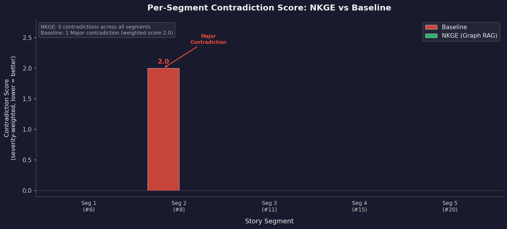
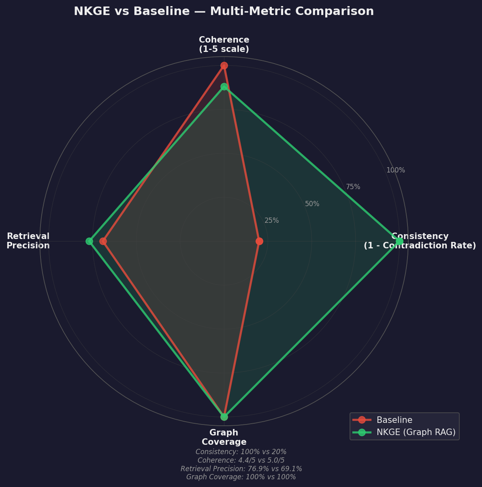
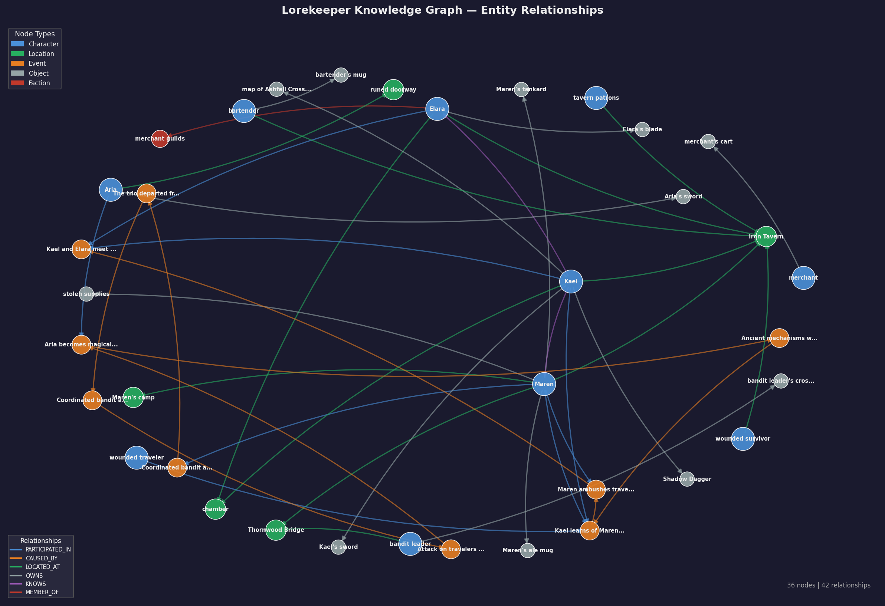

# Lorekeeper

**An LLM storytelling engine that never forgets what happened.**


---

## The Core Problem

LLMs write great narrative text, but they have no memory. Run a multi-turn story session and sooner or later the model kills a character who's already dead, puts someone in a location they can't reach, or forgets who's allied with whom. The longer the story goes, the worse it gets.

Lorekeeper fixes this with a **read-write knowledge graph loop**. After each generated segment, an extraction pipeline pulls entities (characters, locations, events, objects) into a Neo4j property graph. Before the *next* generation, the system retrieves relevant facts from that graph and injects them as hard constraints into the prompt. A **contradiction guard** runs 5 Cypher-backed checks and warns the LLM before it writes, not after.

In a 5-segment paired evaluation against a rolling-text baseline, Lorekeeper produced **zero contradictions** while the baseline introduced a Major one. The graph isn't just storage; it's actively steering the LLM away from inconsistent output.

---

## Architecture


A few of the bigger decisions behind this design:

- **Dual RAG.** Graph RAG (Cypher queries) pulls structured facts the LLM must respect. Vector RAG (ChromaDB) pulls tonal anchors for style matching. They go into different prompt sections with different instruction framing because they serve different purposes.
- **Propose-Validate-Commit.** The LLM proposes entity extractions with confidence scores. Deterministic Python code validates them (fuzzy name dedup, status consistency, confidence thresholds). Only approved proposals get MERGEd. The LLM proposes; it doesn't decide.
- **Pre-generation guard.** Five constraint checks run *before* generation and inject warnings into the prompt. In strict mode, the system retries up to twice, then branches the timeline to isolate the divergence rather than corrupt the main storyline.
- **Persona-differentiated generation.** Each character has a ChromaDB-stored voice profile (speech patterns, emotional baseline, knowledge boundaries) injected separately from facts and tonal context.

---

## Evaluation Results

Same player actions, same seed story, 5 segments. NKGE vs. a rolling-text baseline that keeps the last 3 segments as context (which is how many production systems actually work, not a strawman).

| Metric | Baseline | NKGE | Delta |
|--------|----------|------|-------|
| **Mean Contradiction Score** | 0.40 | **0.00** | **-100%** |
| Critical Contradictions | 0 | 0 | — |
| Major Contradictions | 1 | **0** | -100% |
| Mean Coherence (1-5) | 5.00 | 4.40 | -0.60 |
| Graph Coverage Rate | — | 100% | — |
| Retrieval Precision | 69.1% | **76.9%** | +7.8pp |
| Graph Nodes Created | 0 | 26 | +26 |
| Graph Relationships Created | 0 | 28 | +28 |

The baseline hit a **Major** contradiction in segment 3 (weighted score 2.0). NKGE stayed clean across all five segments.

The -0.60 coherence drop is expected: guard constraints can limit creative freedom. That's a tunable dial, not a bug. We track it explicitly so the trade-off is visible.

> Full methodology, severity weights, and reproduction steps are in the [design document](./NKGE_Project_Design_Document.md).

### Evaluation Visualizations

Per-segment contradiction scores side by side. The baseline spikes at segment 2 with a Major contradiction (weighted 2.0); NKGE stays flat at zero:



The radar chart below shows the full trade-off profile. NKGE wins on consistency, graph coverage, and retrieval precision. The coherence gap is the cost of enforcing constraints, and it's small enough to be worth the trade:



---

## What the Guard Catches

Five checks run against the live graph before every generation:

| Check | Severity | What It Prevents |
|-------|----------|-----------------|
| Dead character active | Critical | Deceased characters showing up in new scenes |
| Location inaccessible | Major | Characters walking into destroyed or blocked locations |
| Object ownership conflict | Major | Two characters owning the same item simultaneously |
| Hostile copresence | Minor | Hostile characters acting friendly without justification |
| Knowledge boundary | Soft | Characters referencing events they couldn't possibly know about |

Here's what the hostile copresence guard looks like in practice:

> **Guard injected:** *"Kael and Maren have a hostile relationship. Their interaction should reflect this tension — do not write them as friendly or cooperative without justification."*
>
> **NKGE output:** *Kael's chair scraped against the wooden floor as he stood. "Thornwood Bridge," he said, his voice cutting through the smoky air. "Wounded traveler came through here bleeding. Said someone with your... particular skills hit his group hard." Maren didn't flinch. "Bridges see a lot of traffic. Dangerous places... accidents happen."*

The guard didn't block the interaction. It made sure the dialogue carried the right tension. The LLM adjusted its tone on its own once the constraint was in the prompt.

---

## Live Story Graph

The graph grows with every generation turn. Node colors:
- **Blue** = Character | **Green** = Location | **Orange** = Event | **Grey** = Object | **Purple** = Segment | **Red** = Faction

The structural relationships that tie things together:
- `PARTICIPATED_IN` links characters to the events they appeared in
- `CAUSED_BY` chains events into a causal timeline
- `LOCATED_AT` tracks where characters currently are
- `OWNS` tracks object ownership as it changes hands
- `KNOWS` captures character relationships, including sentiment (allied, hostile)

These edges are all created deterministically during extraction. The system doesn't rely on the LLM to propose them.



---

## Getting Started

### Prerequisites

- **Python 3.12+**
- **Neo4j Desktop** (Community or Enterprise) running locally on `bolt://localhost:7687`
- **Anthropic API key** for Claude Sonnet

### Setup

```bash
git clone https://github.com/your-username/lorekeeper.git
cd lorekeeper
python -m venv .venv
source .venv/bin/activate  # Windows: .venv\Scripts\activate
pip install -r requirements.txt
```

### Configure Environment

```bash
cp .env.example .env
# Edit .env with your Anthropic API key and Neo4j credentials
```

### Run Notebooks (Recommended First)

Run these in order. Each one is self-contained:

```
notebooks/01_schema_and_ingest.ipynb   # Create schema, ingest seed story
notebooks/02_extraction_pipeline.ipynb  # Demo extraction with HITL review
notebooks/03_dual_retrieval_pipeline.ipynb  # Full pipeline end-to-end
notebooks/04_evaluation_harness.ipynb   # Paired NKGE vs. baseline eval
```

### Run the Interactive Frontend

```bash
streamlit run app.py
```

### Run the API Server

```bash
uvicorn api:app --host 0.0.0.0 --port 8000 --reload
# API docs at http://localhost:8000/docs
```

### Run Tests

```bash
pytest tests/ -v
```

---

## Project Structure

```
lorekeeper/
├── notebooks/
│   ├── 01_schema_and_ingest.ipynb      # Schema setup + seed story ingestion
│   ├── 02_extraction_pipeline.ipynb    # Two-stage extraction demo
│   ├── 03_dual_retrieval_pipeline.ipynb # Full pipeline with dual RAG
│   └── 04_evaluation_harness.ipynb     # Paired evaluation runner
├── src/
│   ├── schema.py          # Pydantic v2 models for the ontology and evaluation types
│   ├── graph_client.py    # Neo4j wrapper with typed queries, MERGE helpers, enrichment
│   ├── extraction.py      # Propose, validate, commit pipeline with auto-linking
│   ├── retrieval.py       # Tiered Cypher (T1-T4) + ChromaDB vector retrieval
│   ├── guard.py           # 5-check contradiction guard + branch manager
│   ├── persona.py         # Character voice profiles via PersonaStore + PersonaGenerator
│   ├── pipeline.py        # LangGraph StateGraph orchestration (read-write-verify loop)
│   ├── prompts.py         # All prompt templates with version tracking
│   ├── eval.py            # LLM judge, paired runner, metric computation
│   └── tracing.py         # OpenTelemetry instrumentation
├── tests/                 # 137 unit tests across 8 test files
├── eval_runs/             # Persisted evaluation artifacts (JSON)
├── app.py                 # Streamlit interactive frontend
├── api.py                 # FastAPI REST API (6 endpoints, OpenAPI docs)
├── prompts_registry.json  # Prompt version governance registry
├── study_packet.md        # Technical study guide with concepts, decisions, and Q&A
├── NKGE_Project_Design_Document.md  # Full system design document
├── requirements.txt
└── .env.example
```

---

## Technical Depth

### Graph Schema

```
(:Character)-[:LOCATED_AT]->(:Location)
(:Character)-[:KNOWS {sentiment}]->(:Character)
(:Character)-[:PARTICIPATED_IN]->(:Event)
(:Character)-[:OWNS]->(:Object)
(:Character)-[:MEMBER_OF]->(:Faction)
(:Event)-[:CAUSED_BY]->(:Event)
(:Segment)-[:REFERENCES_GRAPH_STATE]->(*)
```

All writes go through `MERGE` (never `CREATE`) so operations are idempotent. Every edge carries a `branch_id` to keep timelines isolated from each other.

### Retrieval Priority System

| Tier | What | Priority | Budget |
|------|------|----------|--------|
| T1 | Active scene: characters + relationships at the current location | Always included | — |
| T2 | Causal chain: CAUSED_BY traversal from recent events | If budget allows | 50+ tokens |
| T3 | Hostile tensions: unresolved hostile KNOWS pairs | If budget allows | 50+ tokens |
| T4 | Orphan hints: dormant characters with no recent participation | If budget allows | 100+ tokens |

Token counting uses tiktoken's `cl100k_base` encoding as a proxy for Claude's tokenizer. The variance is roughly 5%, which is close enough for budget enforcement.

### Prompt Governance

Every prompt lives in `src/prompts.py` and is version-tracked in `prompts_registry.json`. Changing a prompt means documenting the rationale and recording eval score deltas before the new version gets promoted. No inline prompt strings exist anywhere else in the codebase.

### Observability

OpenTelemetry traces wrap each generation cycle. The spans carry structured attributes that make it straightforward to debug slow or misbehaving runs:
- `retrieval.graph_tokens`, `retrieval.vector_tokens` for context budget usage
- `guard.violation_count`, `guard.severity.*` for constraint check outcomes
- `generation.output_tokens`, `generation.retry_count` for LLM call stats
- `extraction.proposed/approved/flagged/committed` for pipeline throughput

Console exporter during development; swap in an OTLP exporter to ship traces to a production collector.

---

## API Endpoints

| Method | Path | Description |
|--------|------|-------------|
| `POST` | `/generate` | Run one generation cycle (retrieve, guard, generate, extract) |
| `GET` | `/session` | Current session state (location, characters, branch) |
| `POST` | `/session/reset` | Reset to seed state |
| `GET` | `/graph/stats` | Node and relationship counts |
| `GET` | `/graph/facts` | Structured facts for the current branch |
| `GET` | `/health` | Health check (includes Neo4j connectivity) |

Interactive docs at `http://localhost:8000/docs` via FastAPI's Swagger UI.

---

## Design Philosophy

Every design choice in this system is aimed at one thing: showing that structured memory measurably improves LLM output quality.

Some of the opinions baked in:
- The baseline is **realistic** (rolling text summary of recent segments), not a trivially weak comparison
- Contradictions carry **severity weights** tied to narrative impact, so a dead-character error counts more than a tone mismatch
- The coherence trade-off is **tracked openly**, not swept under the rug
- Guard constraints fire **before generation**, not after, because it's cheaper and more effective to prevent bad output than to detect it
- The extraction pipeline treats LLM output as **untrusted input** with multi-stage JSON recovery and deterministic validation
- Environmental detail objects (things like "morning mist" or "hoofprints") get extracted and stored but intentionally remain structurally unlinked; that's correct behavior, not a gap

The full design rationale is in the [design document](./NKGE_Project_Design_Document.md). The [study packet](./study_packet.md) covers the concepts, design decisions, and interview-ready Q&A behind each phase.

---

## Stack

| Layer | Technology | Why |
|-------|-----------|-----|
| Graph Database | Neo4j 5.x | Native relationship modeling; Cypher makes path queries readable |
| LLM | Claude Sonnet (Anthropic) | Reliable structured output; 200K context window |
| Orchestration | LangGraph | Typed state, conditional routing, built-in branching |
| Vector Store | ChromaDB | Zero-config, embedded, local persistence out of the box |
| Embeddings | sentence-transformers (all-MiniLM-L6-v2) | Runs locally with no API key; 384d is plenty for tonal matching |
| Schema Validation | Pydantic v2 | Runtime validation + JSON schema generation for LLM prompts |
| API | FastAPI | Async-native, auto-generated OpenAPI docs |
| Frontend | Streamlit | Fast to iterate on; has a graph visualization component |
| Observability | OpenTelemetry | Structured tracing with pluggable exporters |
| Testing | pytest | 137 tests across 8 modules |

---

## License

MIT
