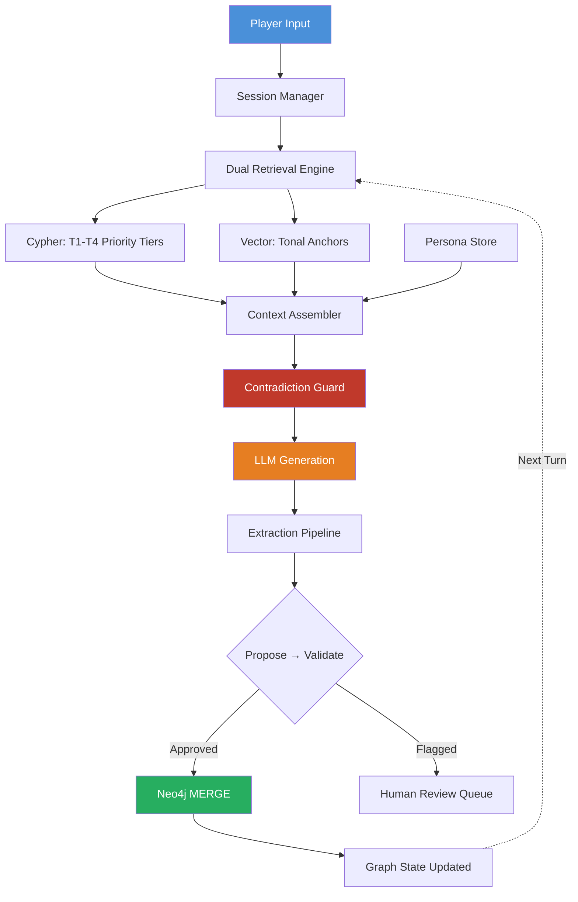

# Lorekeeper

**An LLM storytelling engine that never forgets what happened.**


---

## The Core Problem

Large language models generate compelling narrative text but have no persistent memory. Over multi-turn story sessions, they contradict established facts — killing characters who are already dead, placing people in locations they can't reach, and forgetting the relationships that make a story coherent.

Lorekeeper solves this with a **read-write knowledge graph loop**. Every generated segment is extracted into a Neo4j property graph (characters, locations, events, relationships). Every subsequent generation retrieves relevant facts from the graph and injects them as hard constraints. A pre-generation **contradiction guard** checks 5 graph invariants and warns the LLM before it writes, not after.

The result: **zero contradictions** over a 5-segment paired evaluation, compared to 1 major contradiction for a rolling-text baseline. The graph doesn't just store facts — it actively prevents the LLM from generating inconsistent output.

---

## Architecture



**Key architectural decisions:**
- **Dual RAG** — Graph RAG (Cypher) retrieves structured facts the LLM must honour; Vector RAG (ChromaDB) retrieves tonal anchors for style matching. These populate different prompt sections with different instruction framing.
- **Propose-Validate-Commit** — The LLM proposes entity extractions with confidence scores. Deterministic Python code validates (fuzzy name dedup, status consistency, confidence thresholds). Only approved proposals are MERGEd. The LLM is the proposer, not the decision-maker.
- **Pre-generation guard** — 5 Cypher-backed constraint checks run before generation and inject warnings into the prompt. In strict mode: retry up to 2x, then branch the timeline to isolate divergence.
- **Persona-differentiated generation** — Each character gets a ChromaDB-stored voice profile (speech patterns, emotional baseline, knowledge boundaries), injected separately from facts and tonal anchors.

---

## Evaluation Results

5-segment paired run — same player actions, same seed story — NKGE vs. rolling-text baseline.

| Metric | Baseline | NKGE | Delta |
|--------|----------|------|-------|
| **Mean Contradiction Score** | 0.40 | **0.00** | **-100%** |
| Critical Contradictions | 0 | 0 | — |
| Major Contradictions | 1 | **0** | -100% |
| Mean Coherence (1–5) | 5.00 | 4.40 | -0.60 |
| Graph Coverage Rate | — | 100% | — |
| Retrieval Precision | 69.1% | **76.9%** | +7.8pp |
| Graph Nodes Created | 0 | 26 | +26 |
| Graph Relationships Created | 0 | 28 | +28 |

**Key findings:**
- The baseline produced a **Major** contradiction in segment 3 (weighted score 2.0). NKGE maintained **zero contradictions** across all segments.
- The -0.60 coherence trade-off is expected and explicitly tracked — guard constraints can limit creative freedom. This is a tunable parameter, not a defect.
- The baseline is deliberately **realistic** (rolling summary of last 3 segments), not trivially weak. This is how many production systems actually work.

> Full evaluation methodology, severity weights, and reproduction steps in the [design document](./NKGE_Project_Design_Document.md).

---

## What the Guard Catches

The contradiction guard runs 5 checks against the live graph before every generation:

| Check | Severity | What It Prevents |
|-------|----------|-----------------|
| Dead character active | Critical | Deceased characters acting in new scenes |
| Location inaccessible | Major | Characters entering destroyed/blocked locations |
| Object ownership conflict | Major | Multiple characters owning the same object |
| Hostile copresence | Minor | Hostile characters behaving as allies without justification |
| Knowledge boundary | Soft | Characters referencing events they have no path to know about |

**Example from evaluation run — hostile copresence guard in action:**

> **Guard injected:** *"Kael and Maren have a hostile relationship. Their interaction should reflect this tension — do not write them as friendly or cooperative without justification."*
>
> **NKGE output:** *Kael's chair scraped against the wooden floor as he stood. "Thornwood Bridge," he said, his voice cutting through the smoky air. "Wounded traveler came through here bleeding. Said someone with your... particular skills hit his group hard." Maren didn't flinch. "Bridges see a lot of traffic. Dangerous places... accidents happen."*

The guard didn't prevent the characters from interacting — it ensured their dialogue reflected the established hostile relationship. The LLM self-corrected its tone based on the constraint injection.

---

## Live Story Graph

The knowledge graph grows with every generation. Nodes are colored by type:
- **Blue** = Character | **Green** = Location | **Orange** = Event | **Grey** = Object | **Purple** = Segment | **Red** = Faction

After running the pipeline, the graph contains interconnected entities with structural relationships:
- `PARTICIPATED_IN` — characters linked to events they appeared in
- `CAUSED_BY` — events chained into a causal narrative timeline
- `LOCATED_AT` — characters placed at specific locations
- `OWNS` — object ownership tracked across the story
- `KNOWS` — character relationships with sentiment (allied, hostile)

All relationships are auto-created deterministically during extraction — not dependent on LLM proposing them.

---

## Getting Started

### Prerequisites

- **Python 3.12+**
- **Neo4j Desktop** (Community or Enterprise) with a local database running on `bolt://localhost:7687`
- **Anthropic API key** for Claude Sonnet

### Setup

```bash
git clone https://github.com/your-username/lorekeeper.git
cd lorekeeper
python -m venv .venv
source .venv/bin/activate  # Windows: .venv\Scripts\activate
pip install -r requirements.txt
```

### Configure Environment

```bash
cp .env.example .env
# Edit .env with your Anthropic API key and Neo4j credentials
```

### Run Notebooks (Recommended First)

Execute in order — each notebook is self-contained:

```
notebooks/01_schema_and_ingest.ipynb   # Create schema, ingest seed story
notebooks/02_extraction_pipeline.ipynb  # Demo extraction with HITL review
notebooks/03_dual_retrieval_pipeline.ipynb  # Full pipeline end-to-end
notebooks/04_evaluation_harness.ipynb   # Paired NKGE vs. baseline eval
```

### Run the Interactive Frontend

```bash
streamlit run app.py
```

### Run the API Server

```bash
uvicorn api:app --host 0.0.0.0 --port 8000 --reload
# API docs at http://localhost:8000/docs
```

### Run Tests

```bash
pytest tests/ -v
```

---

## Project Structure

```
lorekeeper/
├── notebooks/
│   ├── 01_schema_and_ingest.ipynb      # Schema setup + seed story ingestion
│   ├── 02_extraction_pipeline.ipynb    # Two-stage extraction demo
│   ├── 03_dual_retrieval_pipeline.ipynb # Full pipeline with dual RAG
│   └── 04_evaluation_harness.ipynb     # Paired evaluation runner
├── src/
│   ├── schema.py          # Pydantic v2 models — ontology + evaluation types
│   ├── graph_client.py    # Neo4j wrapper — typed queries, MERGE helpers, enrichment
│   ├── extraction.py      # Propose → Validate → Commit pipeline with auto-linking
│   ├── retrieval.py       # Tiered Cypher (T1-T4) + ChromaDB vector retrieval
│   ├── guard.py           # 5-check contradiction guard + branch manager
│   ├── persona.py         # Character voice profiles — PersonaStore + PersonaGenerator
│   ├── pipeline.py        # LangGraph StateGraph orchestration (read-write-verify loop)
│   ├── prompts.py         # All prompt templates with version tracking
│   ├── eval.py            # LLM judge, paired runner, metric computation
│   └── tracing.py         # OpenTelemetry instrumentation
├── tests/                 # 137 unit tests across 8 test files
├── eval_runs/             # Persisted evaluation artifacts (JSON)
├── app.py                 # Streamlit interactive frontend
├── api.py                 # FastAPI REST API (6 endpoints, OpenAPI docs)
├── prompts_registry.json  # Prompt version governance registry
├── study_packet.md        # Technical study guide — concepts, decisions, Q&A
├── NKGE_Project_Design_Document.md  # Full system design document
├── requirements.txt
└── .env.example
```

---

## Technical Depth

### Graph Schema

```
(:Character)-[:LOCATED_AT]->(:Location)
(:Character)-[:KNOWS {sentiment}]->(:Character)
(:Character)-[:PARTICIPATED_IN]->(:Event)
(:Character)-[:OWNS]->(:Object)
(:Character)-[:MEMBER_OF]->(:Faction)
(:Event)-[:CAUSED_BY]->(:Event)
(:Segment)-[:REFERENCES_GRAPH_STATE]->(*)
```

All writes use `MERGE` (never `CREATE`) for idempotency. Branch isolation via `branch_id` on all edges prevents cross-timeline contamination.

### Retrieval Priority System

| Tier | What | Priority | Budget |
|------|------|----------|--------|
| T1 | Active scene — characters + relationships at current location | Always included | —  |
| T2 | Causal chain — CAUSED_BY traversal from recent events | If budget allows | 50+ tokens |
| T3 | Hostile tensions — unresolved hostile KNOWS pairs | If budget allows | 50+ tokens |
| T4 | Orphan hints — dormant characters with no recent participation | If budget allows | 100+ tokens |

Token counting uses tiktoken `cl100k_base` as a proxy for Claude's tokenizer (~5% variance).

### Prompt Governance

Every prompt is version-tracked in `prompts_registry.json`. Changes require documented rationale and eval score deltas before promotion. No inline prompt strings exist outside `src/prompts.py`.

### Observability

OpenTelemetry traces wrap every generation cycle with structured attributes:
- `retrieval.graph_tokens`, `retrieval.vector_tokens` — context budget utilization
- `guard.violation_count`, `guard.severity.*` — constraint check results
- `generation.output_tokens`, `generation.retry_count` — LLM call metrics
- `extraction.proposed/approved/flagged/committed` — extraction pipeline throughput

Console exporter for development; OTLP exporter for production collector integration.

---

## API Endpoints

| Method | Path | Description |
|--------|------|-------------|
| `POST` | `/generate` | Run one generation cycle (retrieve → guard → generate → extract) |
| `GET` | `/session` | Current session state (location, characters, branch) |
| `POST` | `/session/reset` | Reset to seed state |
| `GET` | `/graph/stats` | Node and relationship counts |
| `GET` | `/graph/facts` | Structured facts for current branch |
| `GET` | `/health` | Service health check (includes Neo4j connectivity) |

Interactive API docs available at `http://localhost:8000/docs` via FastAPI's built-in Swagger UI.

---

## Design Philosophy

**Every design choice optimizes for the same thing: demonstrating that structured memory measurably improves LLM output quality.**

The system is intentionally opinionated:
- The evaluation uses a **realistic baseline** (rolling text summary), not a trivially weak one
- Contradictions are scored by **severity weights** aligned with narrative impact
- The coherence trade-off is **explicitly tracked**, not hidden
- Guard constraints are injected **before generation**, not validated after — cheaper and more effective
- The extraction pipeline treats LLM output as **untrusted input** with multi-stage JSON recovery
- Environmental detail objects (atmospheric elements like "morning mist" or "hoofprints") are extracted and stored but remain structurally unlinked — this is correct behavior, not a gap

For the full design rationale, see the [design document](./NKGE_Project_Design_Document.md) and [study packet](./study_packet.md).

---

## Stack

| Layer | Technology | Why |
|-------|-----------|-----|
| Graph Database | Neo4j 5.x | First-class relationship modeling; Cypher path queries |
| LLM | Claude Sonnet (Anthropic) | Reliable structured output; 200K context window |
| Orchestration | LangGraph | Typed state, conditional routing, native branching |
| Vector Store | ChromaDB | Zero-config embedded; local persistence |
| Embeddings | sentence-transformers (all-MiniLM-L6-v2) | Local, no API key; 384d sufficient for tonal matching |
| Schema Validation | Pydantic v2 | Runtime validation + JSON schema for LLM prompts |
| API | FastAPI | Async, OpenAPI docs, production-ready |
| Frontend | Streamlit | Rapid iteration; live graph visualization |
| Observability | OpenTelemetry | Structured tracing; console + OTLP export |
| Testing | pytest | 137 tests across 8 modules |

---

## License

MIT
